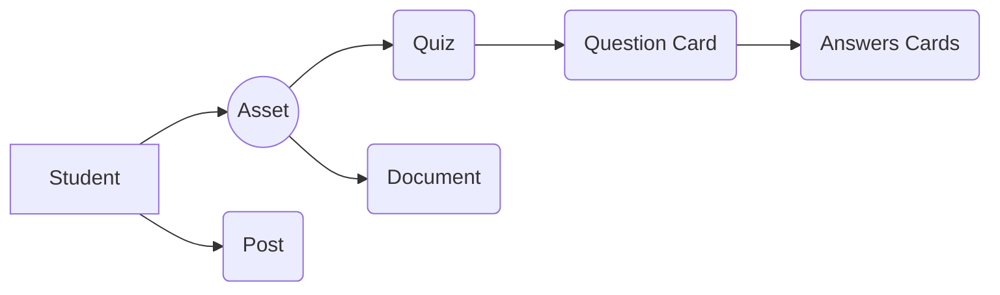

# Lunja Academy

**Lunja** is an E-learning plateform that aims to let students share knowledge about specific university subjects. the Idea is providing students with the tools to create their own **Assets** that contains *Quizzes* and *documents* wich helps them study, these **Assets** could be Private, shared with everyone in the plateform OR specific for a **class**. 

**class** is another concept that lunja supports, it gathers ambisious Students sharing their usefull **Assets** with their friends along with creating **posts** to ask questions, make announcements or for other purposes that serves the learning process. 

Lunja's slogan is:

## "Students For Students"
#
#

|                | Asset                                      | Post                                       |
|----------------|--------------------------------------------|--------------------------------------------|
|Private         |`'can be seen by creator only'`             |                                            |
|Class           |`"can be seen by class members"`            |`"can be seen by class members"`            |
|Public          |`"can be seen by everyone on the plateform"`|`"can be seen by everyone on the plateform"`|

## User Contributions Structure:

## Lunja's Logo:

