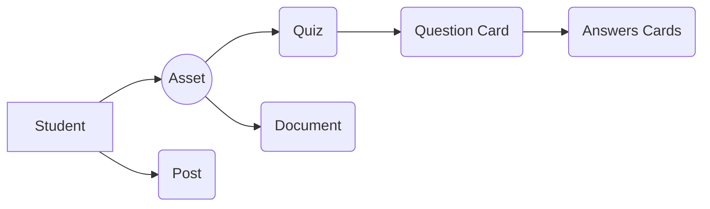

# Lunja Academy

**Lunja** is an E-learning plateform that aims to help students share knowledge between each other about specific university subjects. the Idea is providing students with the tools to create their own **Assets** that contains *Quizzes* and *documents* wich helps them study, these **Assets** could be Private, shared with everyone in the plateform OR specific for a **class**. 

**class** is another concept that lunja supports, it gathers ambisious Students sharing their usefull **Assets** with their friends along with creating **posts** to ask questions, make announcements or for other purposes that serves the learning process. 

Lunja's slogan is:

## "Students For Students"

|                | Asset                                      | Post                                       |
|----------------|--------------------------------------------|--------------------------------------------|
|Private         |`"can be seen by creator only"`             |                                            |
|Class           |`"can be seen by class members"`            |`"can be seen by class members"`            |
|Public          |`"can be seen by everyone on the plateform"`|`"can be seen by everyone on the plateform"`|

## User Contributions Structure:

## Lunja's Logo:

## Api Endpoints
### Authentification:

|     SN           |Method     |Route    |   Request Data | Response Data | description
|----------------|-------------------------------|-----------------------------|--|---|---
|1|POST|/api/auth/login           |{"usernameOrEmail":"<$username>"} | {"ok": Boolean, token} |login
|2|POST|/api/auth/register |{"first_name", "last_name", "username", "level", "password", "account_type", "email"}| {"ok":Boolean, "errors":[]}| register 

